# MyOS: 32-bit x86 Operating System

### Bootloader
BIOS ROM runs immediately upon turning on the PC -> loads the bootloader by searching for the boot signature "0x55AA".
Copies this sector (511 and 512 bytes) to RAM address 0x0000:0x7C00.
Jumps to 0x7C00 to execute the bootloader!
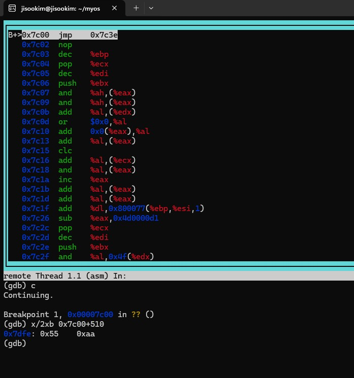  
*Checking boot signature*

> [!My Thoughts]  
> Transitioning from the bootloader to the kernel was very difficult because I had to write it in assembly.  
> In the process of switching to protected mode: loading the GDT, setting the CR0 PE(Protection Enable) bit, and performing a Far Jump.

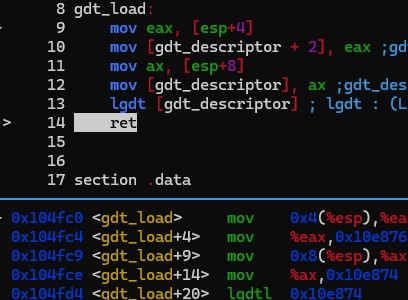  
*GDT descriptor loading via `lgdt` instruction*
- GDT (Global Descriptor Table): a static table that defines the base address, limit, and privilege levels (Ring 0 / Ring 3) for each memory segment.

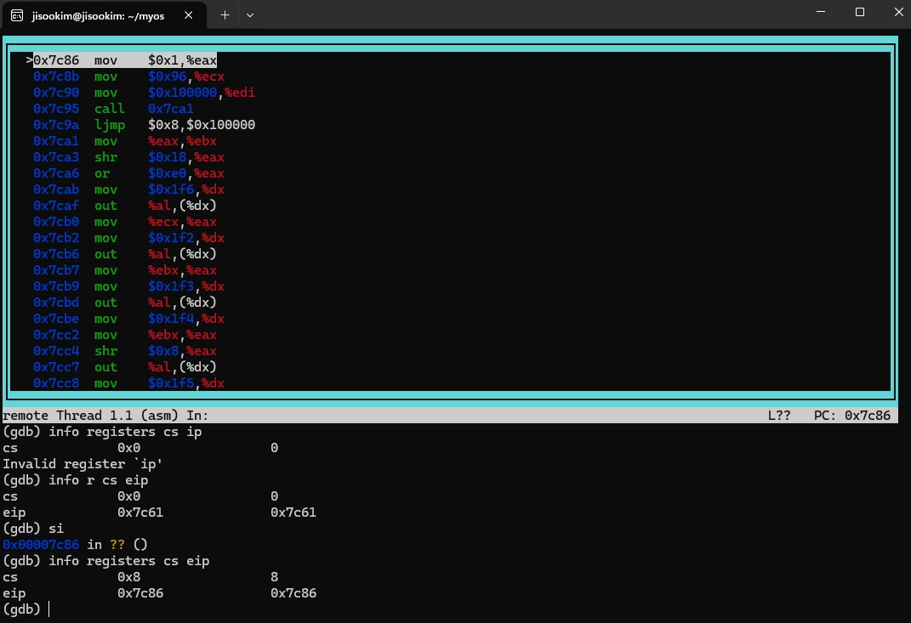  
*CR0 PE bit 0 -> 1 and Far Jump to CS register it change to kernel code seg (offset 0x08)*  
- The GDT is a structure defining segment registers, which can be thought of as a map showing where segments start and end.  
- `CR0 PE` changed 0 -> 1 switches the mode to 32-bit Protected Mode.  
However, we only changed the mode; CPU is not in the kernel yet.  

1. Entering Protected Mode:  
Loading the temporary GDT, setting the `CR0 PE bit`, and performing a Far Jump to 32-bit mode (`load32`).

2. `ATA LBA Loading`: Bypassed BIOS interrupts and directly used the hard disk controller's I/O ports to read data, delivering 150 kernel sectors to the 1MB on RAM.
> It means Kernel sectors start from 1MB.  
> It is like a flat array for sectors, each sector has 512 bytes. it allows like index access to disck sectors.  

3. A20 GATE(BUS): Enabled to allow memory access beyond 1MB addr.

```
[Memory Map]
  0x00100000 + 512 * 150 ~ kernel data
  -------------------------------------------------------------
  0x00100000 - ...      Kernel Code     32-bit Protected Mode
                         (150 Sectors(512*150) loaded by ATA LBA)
  -------------------------------------------------------------
  0x00100000            1MB Boundary (A20 Line)
                         - Enabled : beyond1MB Memory Access.
  -------------------------------------------------------------
  0x00007C00            Bootloader (512 B)     16-bit Real Mode
  0x00000000            RAM Start Base
```

### kernel.asm
1. Initializes all segment registers to the kernel segment (0x10).
2. Sets up the kernel stack (0x200000) so kernel stack is 0x100000 ~ 0x200000.
3. Remaps(IRQ 0-15 -> 32-47) the `PIC`(Programmable Interrupt Controller)which like `NVIC` in `ARM Cortex-M`.

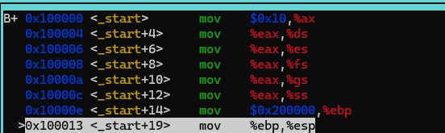  
> Segment registers set to 0x10 and ESP/EBP set to 0x200000 at kernel entry 0x100000.


### kernel.c
1. Redefines `GDT` and initializes the kernel heap.
2. Turns on `IDT` and I/O interrupt timer drivers.
3. Defines `TSS` (Task State Segment) and configures the kernel stack (0x600000) to return to during interrupts.
4. Searches the file system disk to recognize and prepare `FAT16`.
5. Enables paging to manage memory in 4KB blocks and provide strict user/kernel memory isolation.

Why redefine the `GDT`? The bootloader's GDT is a minimal map, while the kernel's GDT is a complete map containing all features needed by the kernel.

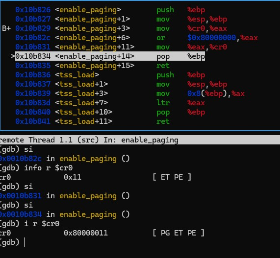
> CR0 PE(Protection Enable) bit -> 1, CR0 PG(Paging Enable) bit -> 1.

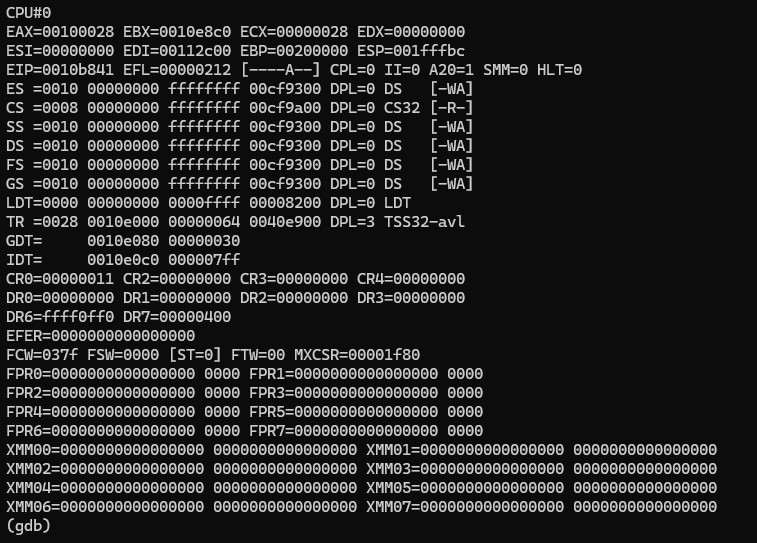
> TR : 0x28

### TSS
`TSS`: Informs the CPU of the kernel stack (esp0) to return to kernel space when an interrupt occurs in user space.

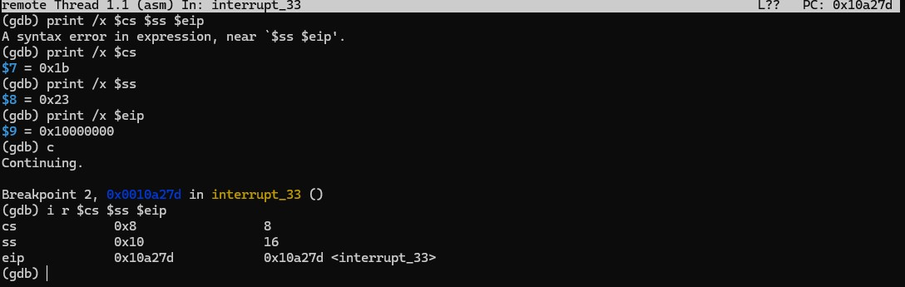
> `Ring 3 to Ring 0`: When an interrupt (int 0x21) occurs in User Mode (CS:0x1B, SS:0x23), the CPU uses TSS esp0 to switch to the Kernel Stack (CS:0x08, SS:0x10) 0x00600000.

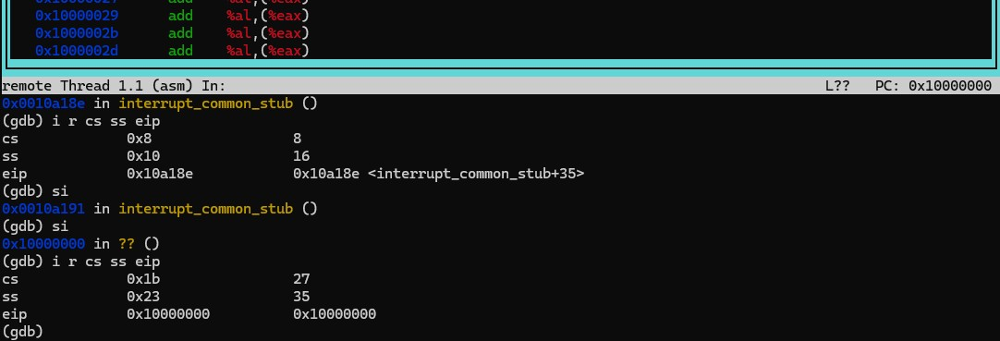
> Ring 0 to Ring 3: when run `black.bin` -> Executing `iret` in Kernel Mode restores registers to enter User Mode (CS:0x1B, SS:0x23, EIP:0x10000000).

```
[Memory Map]
  0x20000000            User Stack Space (512 MB) : 0x1FFFF000
  -------------------------------------------------------------
  0x10000000            User Code Entry (256 MB) : EIP: 0x10000000 (blank.bin / shell.bin)
  -------------------------------------------------------------
  0x01000000            Kernel Heap Area (16 MB) : kernel_heap_init
  -------------------------------------------------------------
  0x00600000            TSS Kernel Stack (6 MB) : tss.esp0 = 0x600000 (Interrupt Return Stack)
  -------------------------------------------------------------
  0x00200000            Kernel Stack Top (2 MB) : ESP / EBP = 0x200000
  -------------------------------------------------------------
  0x00100000 + 512*150  Kernel Code End (~0x00112C00)
  0x00100000            Kernel Code     32-bit Protected Mode (150 Sectors (512 * 150) loaded by ATA LBA)
  -------------------------------------------------------------
  0x00100000            1MB Boundary (A20 Line): Enabled : Beyond 1MB Memory Access
  -------------------------------------------------------------
  0x00007C00            Bootloader (512 B)     16-bit Real Mode
  0x00000000            RAM Start Base
```

### FAT 16Disk
- File Allocation Table : a map to track file data.

- Reserved Region: The area containing the boot sector and our kernel. 
Since `reserved sectors = 200` is configured, sector 0 has the bootloader, and sectors 1 to 199 load and wait for `kernel.bin`.  
> [Design Intent] Instead of putting `kernel.bin` as a normal file in the FAT16 filesystem (which requires a complex FAT parser in the bootloader), I store the kernel raw in the reserved sectors.  
> I know it may waste disk space, but it is much simpler to implement and debug.

- FAT Region: A map showing how clusters are connected (FAT table). Think of it as apartment buildings.
Usually, there are 2 FAT tables, which exist for recovery purposes.  

- Root Directory: A list of files in the root directory (/). Think of it as room numbers in an apartment.
Contains info like file name, extension, size, cluster position, etc. We parse this to find the name and locate the cluster number for the data region.  

- Data Region: The area where actual file contents (text, binary, etc.) are stored.  
Think of it as actual residents.  
Starts from cluster 2; clusters 0 and 1 are already reserved. only number 0 and 1 is reserved! (it doesn't mean that it consumes physical disk space).

### File System
Let's look at the structure of FAT16.
Address (Byte) :  00    01  |  02    03  |  04    05  |  06    07  | ...
            [ Byte 0 ] [ Byte 2 ] [ Byte 4 ] [ Byte 6 ]
-------------------------------------------------------
Contents (Value) : [  0xFFF8  ] [  0xFFFF  ] [    10    ] [    11    ] ...
            (Cluster 0)  (Cluster 1)  (Cluster 2)  (Cluster 3)

A file system is just a rule.
From the OS's perspective, a disk is just a chunk of data composed of 0s and 1s.
The file system driver interprets this as a FAT16 file system and provides an interface.
I used arrays for the file system for extensibility, although I only implemented FAT16.

Keep this structure in mind!
FAT16 physical structure:
Reserved (Boot and Kernel) -> FAT1
FAT1 -> FAT2(Backup)
FAT2 -> RootDir
RootDir -> Data Region  
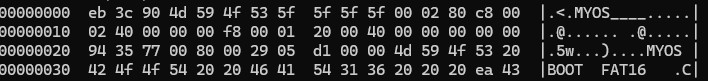  

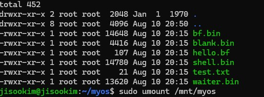

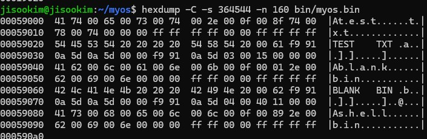

1. Implemented reading data from the disk byte-by-byte using streamers.
2. FAT Header : The BPB describes the layout and parameters of the FAT filesystem. It is stored in the FAT boot sector and can be represented as a structure that maps directly to the corresponding bytes on disk.
3. FAT Table: Linked list.
Core concept: Where are the files scattered?
`fat_entry_pos = (current cluster number) * 2`. Why * 2? Because it is FAT16, so each entry is 16 bits (2 bytes).
4. Address Translation:
The CPU wants to know the address, but FAT16 talks in cluster numbers.
`Sector = (Cluster - 2) * Sectors_per_cluster + root_directory.ending_sector_pos (Data area start)`
If the cluster is 3, then 3 - 2 = 1. Multiply that by the sectors per cluster and add the data area start sector.
Why Cluster - 2? Because clusters 0 and 1 are reserved.
5. Dedicated Streamers:
If you look at our `struct fat_private`, there are multiple streamers (e.g., `cluster_read_stream`, `fat_read_stream`) instead of just one.
Why: When reading a file, you occasionally need to search the FAT table address to find the next cluster. Using only one streamer would corrupt the file read offset. Therefore, I separated the FAT table streamer and the actual data streamer.
6. Directory Structure:
* Root Directory: Located right after the FAT 0 and 1(FAT1, FAT2). The size is fixed based on the number defined(64) in the boot sector (Root Entries) and cannot be expanded.
* Sub-directories: Can be located anywhere in the data region (just like a normal file). The size can expand infinitely since it is connected by a cluster chain[linked list]. It is just a file with a special directory attribute (`0x10`).

### Paging
> Divides physical memory into 4KB pages, providing each process with an isolated 4GB virtual address space.

* Virtual Memory: Even if physical RAM is small, each program is allocated a virtual memory space of 4GB.

* Memory Isolation: Separates user space from the kernel.

* CR3 Register: Holds the physical address of the page directory currently in use.
> This is critical for context switching.
> Swapping the page directory pointer (CR3) from Process A to Process B immediately changes the active memory map.

#### Cache Speed Benchmark (PCD(Page Cache Disable) Bit Control)
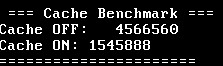  
> **Hardware Cache Benchmark (Cache ON vs Cache OFF)**
> Proves a **300%+ CPU cycle performance difference** (Cache OFF: ~4.6M cycles vs Cache ON: ~1.5M cycles) by controlling the `PCD (Page Cache Disable)` bit in Page Table Entries using `RDTSC` cycle-level measurement.

### RDTSC ###

>> CPU cycle : A single pulse of the CPU clock.
>> CPU Clock Speed : Frequency of the CPU cycles per second.
>> TSC : Time Stamp Counter inside the CPU chip that increments every cycle, read by the `RDTSC` instruction.  
>> memory/debug/cache_check.c : check cpu cache

**IMPORTANT : TSC and CPU cycle are not the same thing. (TSC is the hardware counter that counts CPU cycles.) Since CPU frequency changed dynamically in modern CPU, so it is not recommended to use TSC for measuring time**
>>> `todo` : I just wanted to measure how fast a context switch takes.
BUT! `Switching time is not always same!, not constant`... So I plan to run a loop test to measure the latency variance and time differences

#### How to do mapping v-memory to physical memory? 
Structure: Page Directory -> Page Table -> Physical Frame.
Each process gets its own 4GB virtual memory space.

The memory layout for my OS is configured in `config.h`.
0~256MB: Kernel space.
256MB~512MB: User space.
512MB~4GB : Unmapped Space.
Separating kernel space (0–256MB) and user space (256–512MB) at the 256MB boundary ensures memory protection and allows fast pointer validation during system  
> why 512MB~4GB is unmapped space? : i had to adjust to the system spec of QEMU and
Fully mapping the entire 4GB address space would waste memory by allocating unnecessary page tables.   

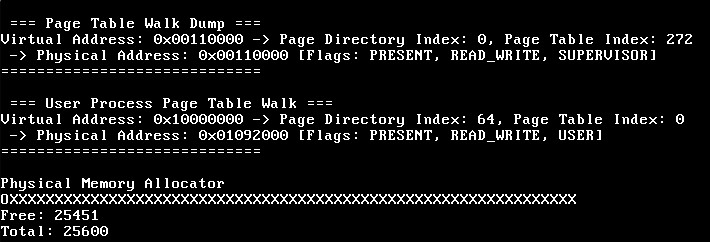  
> **Virtual Address to Physical Address Translation (Page Table Walk Dump)**:  
> I tested 2-level page table structure (`Page Directory Index` -> `Page Table Index` -> `Physical Frame Address`) and parsing `Page Table Entry flags` (`PRESENT`, `READ_WRITE`, `USER` / `SUPERVISOR`, `CACHE_DISABLED`) directly in hardware.

Paging structure:
Note that we manage memory in 4KB blocks per page.
Total is 1024 * 1024 * 4096 = 4GB.
1. Page Directory: Contains 1024 entries, each holding the physical address of a Page Table (like a country).
2. Page Table: Address index (like a city).
3. Page Table Entry: Page index (4 bytes) holding the physical address of the Page Frame (like a neighborhood/district).
4. Page Frame (Physical Frame, 4KB): Physical memory page (like an actual street address).

#### Heap
Heap Table:
Remember we manage memory in 4KB blocks.
An array managing the kernel heap status.
Each entry represents a 4KB memory block.
`[ 7(NEXT)][ 6(FIRST)][ 5 ][ 4 ][ 3 ][ 2 ][ 1 ][ 0(TAKEN/FREE)]` (Other bits are currently unused, but can be added).  

When `malloc` is called -> calculates the required blocks via `heap_calculate_required_blocks(size)` -> searches for contiguous free space that satisfies the requested size starting from the beginning of the table (Index 0) -> calls `heap_mark_blocks_as_taken()` to mark them as "taken" -> returns the address.

```markdown
#### Fault
```c
// test code in shell.c
int *a = NULL;fault_CR2
*a = 1;
```
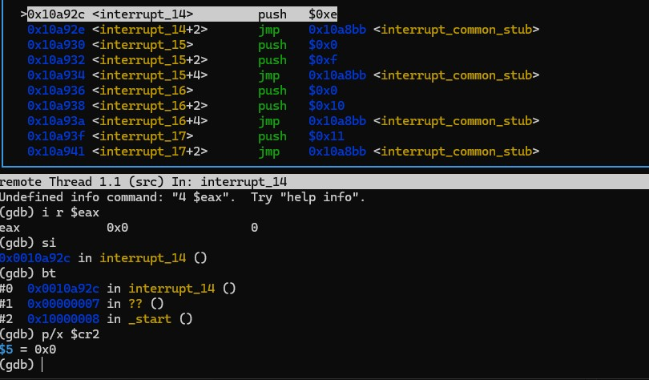


#### Interrupt
When ring3(user mode) calls `int 0x80`(I would say it is like Software BUS, it connects usre mode to kernel mode) ->
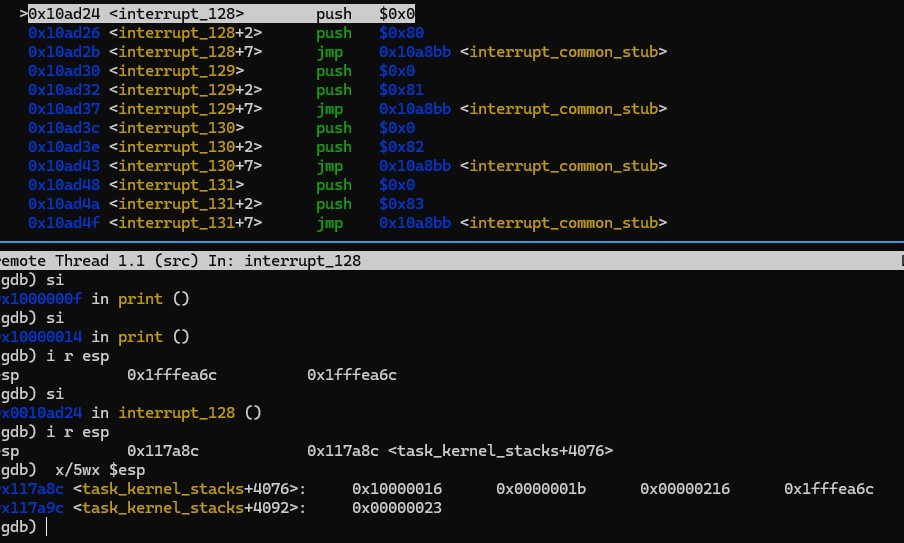
The CPU looks at the TSS, shifts the stack pointer to `ESP0` (kernel stack), and backs up the original states (user stack, address, code location) onto the kernel stack.
Then it restores states (see Restore state in `idt.asm`) via `popad` and returns via `iret`.
In `idt.asm`:
Note that `pop` increments esp by 4, which is different from `push`. Restoring `esp` into register was new to me.

``` Restore code.
; Restore state
    pop gs         ; Pop segment registers one by one
    pop fs         ;
    pop es         ;
    pop ds         ;
    popad          ; Restores saved EAX, EBX... all 8 registers at once!
    add esp, 8     ;
    iret           ; Return to Ring 3
```

1. IDT (Interrupt Descriptor Table):
Entries from 0 to 255 containing information for each interrupt.
Jumps to ISR when a specific signal number triggers!
Initialized with `idt_init()`.

2. ISR (Interrupt Service Routine):
The function that executes the actual interrupt.
This was a bit complicated. I referenced assembly in `idt.asm`, processed common routines, and called the C function.

nasm assembly syntax was quite challenging, and I relied heavily on OSDev Wiki.
Also, the first member of the structure actually points to the top of the stack (the lowest address). I encountered errors initially because I didn't know this.

3. ISR80h:
Puts the system call number in EAX and jumps to `interrupt_128`.
Jumps to `interrupt_handler` after executing `pushad`.
In `interrupt_handler`, checks EAX to process the system call (verifies `isr80h_handle_command`).

How is data passed?
* User program pushes arguments (string pointer) onto the stack.
* Kernel reads the user stack contents using `task_get_stack_item`.
* Then copies data from user to kernel using `copy_from_task`.
Note: The kernel temporarily switches paging (`paging_switch`) to the user's page directory, reads that memory, and returns to the kernel.
4. Hardware Interrupt:
Reads data from ports using the I/O bus.
Pressing a key triggers IRQ 1 -> jumps to IDT 0x21 -> reads data from port 0x60 (keyboard data port).
`io.asm` acts as the driver.

#### TASK/Thread...
A task is a thread.
How does a task use process shared resources?
1. Create a process first.
2. When calling `init_task`, creates a 4GB memory directory. Here, `task->process = process`.
3. Load file data -> load into physical memory.
4. Important point:
`process_map_memory` maps virtual memory to physical memory.
Each task has a page directory. `process_map_binary` maps the process physical address to the page directory. 
This means multiple tasks can share the process physical memory space.
  
> think how distribute memory to thread..
> malloc...? dangerous and Latency,,
> stack....?  this creates too much dependency on the caller...
> how to share process resources and how to make it independant...??
> okay,,ja if i make a thread in a proc their cr3 are same right ..okay..should be same... then .data/.bss area..okay global variables ..okay ! or should i make an other memory area..? in the linker.ld?
  
> `sys_thread_exit` bug: after called it , the scheduler must switch to the next_task.
>but if (next_task == main_task), since the main task was not in `TASK_READY` state, QEMU hung in an infinite loop. 
>i need to set it's state to `TASK_READY`.

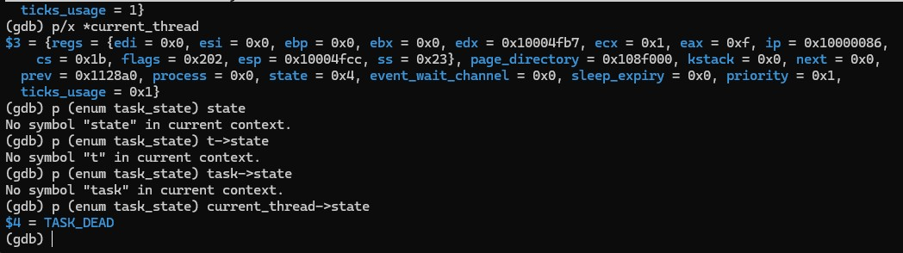  
  
> task_delete bug : use After Free
> `task_cur` was not updated before the task memory was freed (`kfree`). Consequently, `get_next_task()` attempted to read `task_cur->next` from the freed memory block (`0xF000EF57`),  > > where is not allocated space...
> so that if `task == task_cur`, `task_cur` is safely updated to `task->next ? task->next : task_head`.

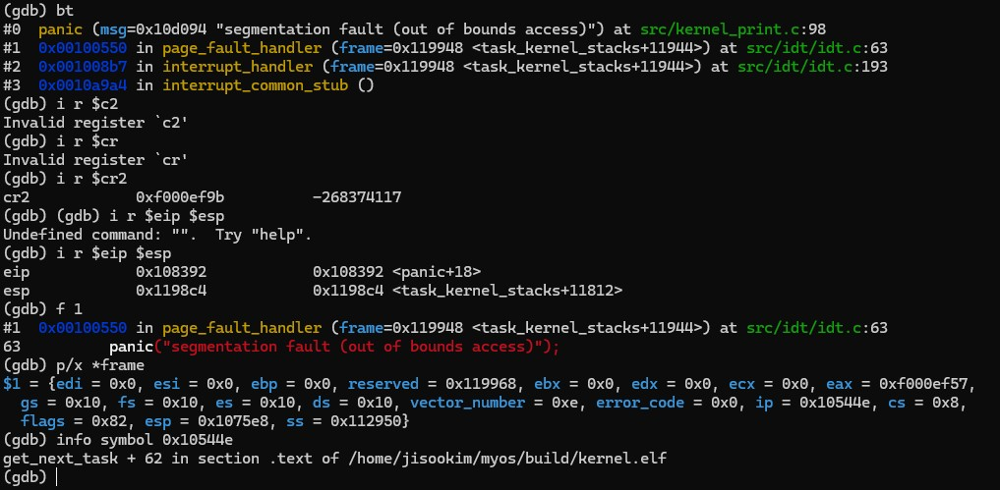  
  
> 'data_race' bug : since Threads sharing others except of registers and it's stacks so .bss/.data/.heap is shared,  

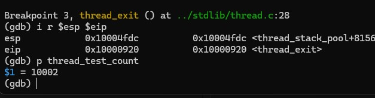 --> need to make mutex!

> 'lock' check : 

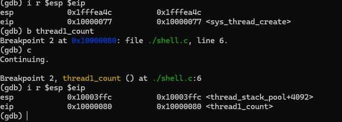.  


#### Scheduling (Context Switching)  
1. Scheduling: Preemptive Priority-Based Scheduling.
Selects the next task to run by following the list's next pointer in a Round-Robin style(Circut).  
Uses timer interrupts to perform preemptive scheduling every 10ms.  
The OS forces a switch even if the task doesn't yield.  
Why preemptive?  
Because even if a program gets stuck in a bug, the OS forces a switch every 10ms so it doesn't freeze.  
Implementing a priority queue to schedule based on priorities could be a good improvement.  
How is priority distinguished? -> If a task runs for 100ms continuously, its priority is lowered to keep the system responsive.

Alternative approaches:
Assigning fixed priorities to each task (important in embedded systems), or reservation schemes.  
2. Context Switching:  
`task_switch` and `task_return`.  
3. Paging Switch (CR3 Switch):  
`paging_switch(task->page_directory)`.  
Puts the page directory address of the new task into the CR3 register.  
At this moment, the virtual memory space observed by the CPU instantly changes from Task A's world to Task B's world (code region and 16KB stack are swapped).  
4. Privilege Recovery (TSS Update):  
`tss.esp0 = main_task_create->kstack + 4096`.  
TSS (Task State Segment): Informs the CPU of the kernel stack (Ring 0) to use when an interrupt occurs in user mode (Ring 3).  
Since each task has its own kernel stack, the TSS must be updated on every switch!  

* NOTE: Currently in MyOS, the shell keeps running even when idle (wasting CPU cycles). 
> need to add IDLE STATE FUNCTION.

* NOTE: since my LOCK is busy-way.. so i need to change mutex style.. dann BLOCKED!

* NOTE : need to make thread_join

#### PROCESS
A container (house) that includes memory, files, etc.
An active worker that occupies the CPU and executes code (the target of Context Switching).
A process has one or more tasks (currently 1:1, but can be expanded for multitasking).
Creation flow: `process_load_for_slot -> process_load_data -> process_map_virtual_memory -> process_setup_arguments -> iret`.

#### ELF
ELF is like a map showing where code and data belong.
Flow: `process_load_data -> elfloader_load_elf`.

#### Sbrk (Memory Allocation)
If a user program runs out of heap space during malloc, it requests the `sbrk` system call (defined in malloc functions).
Increases the process's `cur_end_heap` and maps actual physical pages for the expanded space.

#### Execution Method
1. Run `./build.sh` to compile the kernel and user programs.
2. Run `qemu-system-i386 -hda ./bin/myos.bin` to execute the OS.
3. Enter commands in the shell: `run 0:/bf.bin 0:/hello.bf`
4. `run 0:/blank.bin` (Test running an empty program)
5. `run 0:/waiter.bin` (Parent-child process wait test)
6. `run 0:/shell.bin` (Test running the shell)

##### References
I referenced OSDev Wiki whenever I got stuck.
- OSDev Wiki (https://wiki.osdev.org): Essential for understanding hardware specifications and structuring structs.
- Simhs93's Blog (https://m.blog.naver.com/simhs93/): An excellent lecture series in Korean.
I referenced these two the most.

Personal Reflection:
There was a lot to learn, including assembly. Although I am still not fluent in writing it, I can now read the code, follow the execution flow, and implement necessary features.
I had some understanding of interrupts, but I learned how the kernel transition works by implementing the TSS.
I also learned to separate the kernel stack and user stack while implementing the task struct.
Assembly felt like a foreign language at first, but analyzing `boot.asm` through `kernel.asm` line-by-line was an invaluable experience in learning how to communicate with hardware.
Debugging the kernel using GDB was also extremely helpful, though writing the Makefile was quite complex and difficult.

#### PCI Bus (Peripheral Component Interconnect)
Located on the motherboard.
The CPU requests Bus 0, Slot 1 from port 0xCF8 (PCI controller address port) using `outl`.
The motherboard responds to port 0xCFC (PCI controller data port).
Then the CPU reads the response using `inl`.
Essentially, it is a system that scans and connects internal devices.

NICs and GPU addresses change frequently.
Why?
Plug and Play: Once plugged in, the BIOS/OS finds and assigns a vacant address.
This is highly flexible when adding devices.
If you plug a NIC into slot 1 it becomes address 101, and into slot 2 it becomes 201.
Therefore, the OS must query the PCI controller (0xCF8) to use the device.
Is room 101 occupied? -> None (0xFFFF)
Is room 102 occupied? -> Realtek NIC (0x10EC)

Address Acquisition:
How do I communicate with it? -> Go to Base Address 0xC000 (BAR0).
Communication Start:
Sending data to 0xC000 goes to the NIC.
Our NIC is RTL8139.

#### rtl8139
RTL8139 network driver.
Detects devices via the PCI bus and handles packet transmission/reception. See `rtl8139.h`.
Packet Transmission (TX): Uses 4 slots in a round-robin format.
Packet Reception (RX): Uses WRAP mode.
WRAP Mode: Saves packets continuously without truncation. That's why I added `+1500` bytes. It is simple to implement but requires more memory.
To test packets, Wireshark is required.
Command: `qemu-system-i386 -hda ./myos.bin -netdev user,id=net0 -device rtl8139,netdev=net0 -object filter-dump,id=f1,netdev=net0,file=dump.pcap`

#### Ethernet Frame
Ethernet is a protocol for transmitting data over LAN cables (Local Area Network).
Local, not wide area. Different from Wi-Fi!
Format:
[Dest MAC Addr (6 bytes)] [Src MAC Addr (6 bytes)] [Frame Type (2 bytes)] [Payload (Max 1500 bytes)]

##### ARP (Address Resolution Protocol)
Structure under Ethernet Frame:
Ethernet Header (14 bytes) -> ARP Packet (28 bytes)
ARP: Resolves IP address to MAC address. Why? Ethernet communicates using MAC addresses (Layer 2).
Think of it like a contacts app. We only know the IP address, so we query to find the MAC address.
Debugging tip: I forgot to swap between network byte order and host byte order, causing it to fail initially.

##### IP (Internet Protocol)
Structure:
Ethernet Header (14 bytes) -> IP Header (20 bytes) -> Payload
IP: Transmits actual data (Layer 3).
- Source IP
- Destination IP
- Protocol (TCP, UDP, ICMP...)
- Data (Payload)
- TTL (Time to Live): Expiration of the packet.

##### ICMP (Internet Control Message Protocol)
Ping protocol: A signal sent to verify connection.
ICMP: Relays diagnostic information when IP packet transmission, reception, or routing fails.
In `bits.h`:
Network: Big-endian
CPU: Little-endian
Because of the different bit orders, `ntohs` and `ntohl` must be used.
I missed this frequently during testing, so packets sometimes didn't show up in Wireshark.

##### TCP (Transmission Control Protocol)
In little-endian systems, bits are filled right-to-left.
The struct declaration order is reversed compared to the actual memory layout!
Layers: Ethernet | IP | TCP | Data (14 + 20 + 20 + payload)
Segment = TCP Header + Data
Packet = IP Header + Segment
Frame = Ethernet Header + Packet

Connection:
3-way-handshake (SYN -> SYN-ACK -> ACK) without data payload to verify connection.

Debugging:
Used Wireshark to track SEQ and ACK numbers to verify delivery.
When connecting with HTTP, I encountered errors because the buffer size was set too small.
Also, because host (little-endian) and network (big-endian) byte orders differ, I had to ensure ntohs and ntohl were used consistently, which was a common source of bugs.

